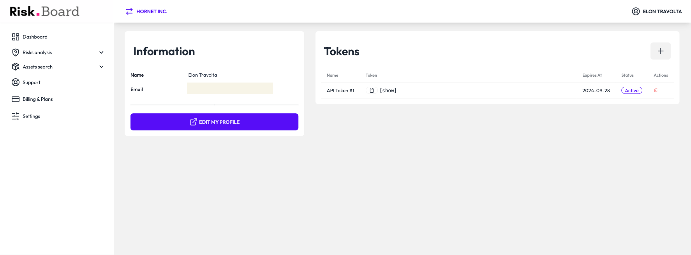

The Rest API is accessible at [:material-web: sailor.riskboard.eu](https://sailor.riskboard.eu)

## :octicons-repo-24: OpenAPI

The OpenAPI specification is available at [:material-code-json: /v1/openapi.json](https://sailor.riskboard.eu/openapi.json)

## :octicons-shield-lock-24: Authentication

Authorization flows are be done by using token authentication.

To get a token, you must create one on your profile. Once you have created a token, you will be able to copy it.



The token must be provided in the header `X-Sailor-Token` of each request.

If it's not valid, a `401 – Unauthorized` response will be returned.

??? example "HTTP request example"

    ```http hl_lines="3"
    GET /users/me HTTP/1.1
    Host: sailor.riskboard.eu:443
    X-Sailor-Token: $TOKEN
    ```

RiskBoard is a multi-tenant application. This implies you have to choose an organization to work with. The organization is the top level entity in RiskBoard. It is the container for all other entities. The organization is also the entity that is billed for the usage of RiskBoard.

To get a list of all organizations you have access to, you can use the following endpoint:

```http hl_lines="3"
GET /users/me HTTP/1.1
Host: sailor.riskboard.eu:443
X-Sailor-Token: $TOKEN
```

The response will be a list of organizations:

```json hl_lines="6-14"
{
    "email": "REDACTED",
    "uid": "REDACTED",
    "displayName": "Elon Travolta",
    "preferences": {},
    "memberships": [
        {
            "role": "OrgAdmin",
            "organization": {
                "slug": "hornet-inc-1z7t",
                "displayName": "Hornet Inc."
            }
        }
    ],
    "auth": {}
}
```

You can then use the `slug` of the organization to query the API.
The URL will be `https://sailor.riskboard.eu/orgs/{slug}/...`.