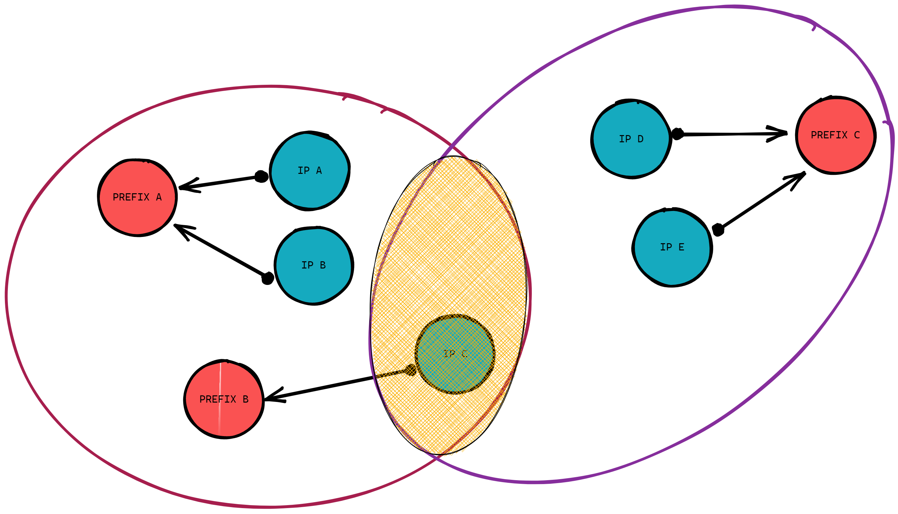

# Welcome to Atomics documentation

    

Atomics is an innovative project of **Cybersecurity Knowledge Graph :material-graph:**.

It's aim is to graphically represent and map assets, keeping an history of relations between assets, evaluate risks and rate assets based on their relationships with others.

It was designed to improve security analysis by giving a complete representation of relationships and related assets.

*An example of shared IP between entities :smile:*